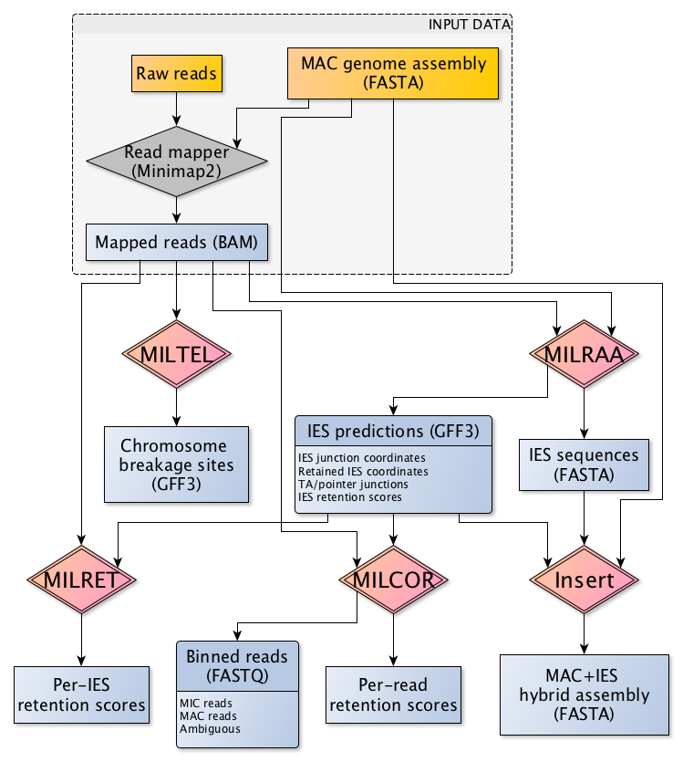

Blepharisma Toolbox for Interspersed DNA Elimination Studies (BleTIES)
======================================================================


[](https://zenodo.org/badge/latestdoi/294123134)

BleTIES is a tool for prediction and targeted assembly of internally eliminated
sequences (IESs) in ciliate genomes, using single-molecule long read
sequencing. The design and name of the software was inspired by
[ParTIES](https://github.com/oarnaiz/ParTIES).


Input data
----------

 * Ciliate MAC genome assembly, Fasta format.
 * Long read library (PacBio subreads or CCS, Nanopore reads) mapping onto that
   assembly, sorted/indexed BAM format; mapper should report valid CIGAR string
   and NM tag.


Installation
------------

Dependencies are specified as a Conda environment YAML file `env.yaml`. Create a
Conda environment with the specified dependencies, then install bleties locally
with `pip`:

```bash
cd /path/to/bleties # path to this folder
conda env create -f env.yaml -n bleties
conda activate bleties
pip install .
```

Run tests after installation:

```bash
python -m unittest -v bleties.TestModule
```


Usage
-----

To list input arguments and options and their respective usage, use the `-h` or
`--help` option, with or without the subworkflow names:

```
bleties --help
bleties milraa --help
bleties miser --help
bleties milret --help
bleties milcor --help
bleties miltel --help
bleties insert --help
```

In addition there are two scripts for plotting the output from the MILRAA and
MILCOR modules. See the `--help` messages for usage instructions:

```
milcor_plot.py --help
milraa_plot.py --help
```


Outline of workflow
-------------------

Refer to the individual module pages for further information.

 * [MILRAA](milraa.md) -- Identify putative IESs and IES junctions from a
   mapping of long reads (uncorrected PacBio or Nanopore, or PacBio CCS reads)
   to reference genome assembly.
 * [MISER](miser.md) -- Screen for potentially erroneous IES calls, to curate
   the list of putative IES junctions (experimental!).
 * [MILRET](milret.md) -- Use curated IES junctions, or IES junction
   coordinates from third-party tools, to calculate IES retention scores from
   mapping of CCS reads to a reference MAC assembly.
 * [MILCOR](milcor.md) -- Calculate per-read IES retention scores and bin reads
   as MIC/MAC in origin, from mapping of CCS reads to MAC assembly.
 * [MILTEL](miltel.md) -- Identify potential chromosome breakage sites with
   telomere addition, from mapping of CCS reads to MAC assembly.
 * [Insert](insert.md) -- Utility for inserting IES sequences from a MAC
   reference genome to generate MAC+IES hybrid sequence. Also can perform the
   reverse operation.



Citations
---------

BleTIES is research software. Please [cite us](../CITATION.md) if you use the
software in a publication.
