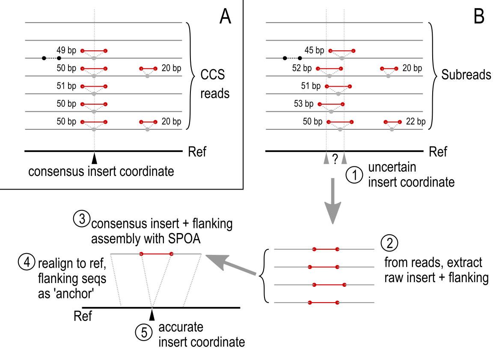

MILRAA - Method of Identification by Long Read Alignment Anomalies
==================================================================

The MILRAA module predicts likely IES insertion/deletion coordinates from a
mapping of long sequencing reads onto a reference genome assembly. The reads
must first be aligned to the reference, which is assumed to be somatic (MAC) but
possibly with some IESs retained in the assembly. The alignment is assumed to be
accurate. The outputs are the coordinates of the predicted IES indel positions,
and IES consensus sequences.

The recommended aligner is [minimap2](https://github.com/lh3/minimap2), with
the options `--secondary=no --MD`, with PacBio subreads/CLR reads (use option
`-ax map-pb`), or PacBio CCS/HiFi reads (use option `-ax asm20`) or Nanopore
long reads (use option `ax map-ont`).


Input data
----------

 * Ciliate MAC genome assembly, Fasta format.
 * Long read library mapping onto that assembly, sorted/indexed BAM format;
   mapper should report valid CIGAR string and NM tag.


Differences of long read to short read alignments
-------------------------------------------------

MILRAA is analogous to the MIRAA module in the ParTIES pipeline that was
originally designed to work with Illumina short read data. The original ParTIES
MIRAA uses an initial Bowtie2 mapping step (local mode) and looks for
breakpoints in the alignment, which are identified as insert (I), soft clip
(S), or hard clip (H) operations from the CIGAR string of the SAM record. 

The insert size for Illumina paired end libraries is typically 300-400 bp, so
on average each read pair would span at most one IES. Most read pairs are
unlikely to span a complete IES nor contain the entire IES sequence. In
comparison, a long read with lengths 10 kbp or more may span multiple IESs, and
the entire IES sequence can potentially be read out form the sequence.

Therefore, MILRAA has the following differences to MIRAA:

 * Each read potentially covers multiple indels, unlike MIRAA which considers
   one read as support for at most one IES.
 * Reads are not paired, so "insert size" is not an issue, and the entire insert
   sequence can be extracted from the reads.
 * However, the error rate of long reads, even HiFi/CCS reads, is expected to
   be higher, so extracted insert sequences are aligned to get a consensus IES
   sequence, and a minimum indel length is required for IES calling (because
   many short indels are expected from sequencing error).


Pointers and TA junctions
-------------------------

IESs can be bounded by TA junctions or pointers (tandem repeats). One copy of
the pointer or TA is excised with the IES, while another copy remains on the
macronuclear destined sequence (MDS).

MILRAA uses the following conventions for coordinates, although they may not
correspond to the way that the physical bases are excised in the actual DNA
molecule:

 * The coordinate of an IES junction (i.e. IES has been excised from the
   reference genome) is to the left of a pointer or TA sequence in the
   reference genome.
 * The coordinate of an IES region (i.e. IES is retained in the reference
   genome) is to the left of the first pointer or TA sequence. The leftmost
   pointer/TA is considered the IES copy, and the rightmost pointer/TA as the
   MDS copy.

The coordinates reported in the `start` and `end` columns of the MILRAA GFF3
output are the coordinates based on the insert/deletion operations reported by
the mapper. However, if an indel is flanked by tandem repeats, there is
ambiguity as to where the "true" indel is, because it is not possible to tell
from the sequence alone where in the repeated sequence the physical cut
occurred.

For example, consider the following sequence containing an IES (upper case)
surrounded by MDS (lower case), the junctions are indicated with the pipe
character `|`:

```
gcgc|TAATGGTGCC|taatccgc (MDS + IES)

gcgc|----------|taatccgc (MDS only)

----|TAATGGTGCC|-------- (IES inferred sequence)
```

Notice the pointer sequence `TAAT` repeated in the left side in the IES, and to
the right of the junction in the MDS.

The first sequence (MDS + IES), when mapped onto the MDS sequence, would have
the CIGAR string `4M10I8M`. 

However, it is also possible to map it another way, with the CIGAR string
`8M10I4M`. The `TAAT` sequence now lies on the right side in the IES, and to
the left of the junction in the MDS. The MDS + IES and MDS-only sequences have
not changed, only our decision of where to place the junction of the inferred
indel.

```
gcgctaat|GGTGCCTAAT|ccgc (MDS + IES)

gcgctaat|----------|ccgc (MDS only)

--------|GGTGCCTAAT|---- (IES inferred sequence)
```

Because the insert is flanked by the repeated pointer sequence, alternative
mappings of `5M10I7M`, `6M10I6M`, and `7M10I5M` are also possible. To deal with
this ambiguity, MILRAA does the following:

 * If the putative IES indel, as reported by the mapper's original output, is
   flanked by repeats, these are reported as putative pointer sequences, along
   with the original indel coordinates from the mapper.
 * If the mapper reports the indel with the pointer/TA on the right side in the
   IES region, then the coordinates are adjusted so that it lies in the left
   side in the IES.
 * If the putative pointer contains a "TA" sequence, this is reported as a
   possible TA junction, and the adjusted coordinates for this TA junction are
   reported.
 * If it is possible to extend the repeats on their left sides to be longer
   than what the mapper reports, then the longest possible repeat (pointer) is
   reported, as well as the corresponding adjusted coordinates.

The pointer sequences and adjusted coordinates are reported in the `attributes`
field of the MILRAA GFF3 file, as described below.


Subreads vs CCS reads
---------------------

PacBio sequence data is typically reported as "subreads" (see [PacBio SMRT
primer](https://pacbiofileformats.readthedocs.io/en/10.0/Primer.html)).
Briefly, subreads in PacBio sequencing correspond to individual passes of a DNA
molecule in a zero-mode waveguide (ZMW), where the sequencing adapters have
already been removed from the sequence. Because a single molecule in a ZMW can
undergo multiple sequencing passes, it can be represented by more than one
subread in the sequencing data. For improving sequence quality, multiple passes
are advantageous: the multiple subreads from a single ZMW can be used to
generate a consensus sequence with higher accuracy than individual subreads,
known as [circular consensus sequencing](https://ccs.how), or CCS.

CCS reads are typically highly accurate (errors less than 1%), compared to
subreads which can have error rates of 5-15%. However, to generate CCS reads,
the sequencing depth of a library must be relatively high.

Subreads and CCS reads are handled differently by MILRAA to predict the
positions of indels. This is chosen with the option `--type subreads` (default)
or `--type ccs` respectively. The experimental `ccs` mode has been tested with
PacBio HiFi Sequel II and may not work well with CCS reads from earlier PacBio
generations with slightly higher error rates. `subreads` mode should work with
CCS reads too.

Uncorrected Nanopore reads should also be run with `--type subreads` mode.

Diagram of MILRAA workflow for CCS reads vs. subreads:




### IES junction position and consensus sequence

With subreads, the error rate is high enough that the insert position reported
by the mapper may not be accurate. Therefore, from the list of insert
coordinates reported by the mapper (inserts above a minimum length threshold),
clusters of insert coordinates which are no more than 2 bp from each other are
extracted. If the number of insert-containing subreads in a cluster is above the
coverage minimum, these are further processed to get the consensus sequence of
the insert. The insert sequence and a flanking region of the mapped reads are
extracted and aligned to get a consensus sequence, using
[SPOA](https://github.com/rvaser/spoa). This insert+flanking consensus is then
aligned with the corresponding region on the reference sequence. The flanking
sequence helps to "anchor" the consensus in the reference, so that we can
extract a more accurate insert coordinate. If this adjusted coordinate is more
than 5 bp away from the original coordinates, an error is reported; this may
represent inserts where the flanking regions on some reads are not homologous to
the reference, e.g. from mapping of paralogs or from sequencing errors.

With CCS reads, the insert position reported by the mapper is assumed to be
accurate. The insert sequence from an individual CCS read is also assumed to be
accurate. However, even with CCS sequences the error rate is high enough that
individual insert sequences at the same coordinate may vary from each other,
including by indels. The higher the coverage, the more variants will be
expected. Furthermore there is also the possibility that a site may experience
alternative excisions, where the sequences excised may be of different lengths:
see the section "Fuzzy IES length matching" below.


### Read coverage

Because the number of subreads produced can differ substantially between ZMWs,
it is preferable to count the physical molecules, represented by the individual
ZMWs, rather than the subreads, to represent the read coverage. This
information is parsed from the read names in the mapping file, which are
assumed to follow PacBio convention. Therefore if the reads have been renamed,
e.g. in a file downloaded from NCBI SRA, the subread vs. ZMW coverage reported
will not be correct.

For CCS reads, each CCS read originates from a single ZMW, so the CCS coverage
is used directly as the read coverage.


Fuzzy IES length matching (CCS mode)
------------------------------------

The default mode for CCS read mappings is "strict", i.e. to define a given IES
junction, all the insert operations at a given coordinate must have the same
length. However, this does not account for sequencing errors that may introduce
indels, nor the possibility of different excised sequences at the same
coordinate.

With the `--fuzzy_ies` option, insert sequences (putative IES sequences) at a
given coordinate are extracted from the mapped reads. These are pairwise
aligned and clustered by sequence identity. The clusters are then split at a
identity threshold given by the `--cluster_dist` option (default 0.05, i.e.
5%). Clusters are then used to define an IES junction if they meet the minimum
coverage threshold. The consensus IES sequence is produced from a multiple
sequence alignment (with Muscle) of the cluster members. Gaps are reported in
the output Fasta file (with the `-` character), but gaps are ignored when
predicting a pointer sequence.


Output
------

MILRAA produces the following output files by default (`{OUT}` is the output
filename prefix, supplied with the `--out` option):

 * `{OUT}.milraa_ies.gff3`
 * `{OUT}.milraa_ies.fasta`

With the `--fuzzy_ies` option, the following additional outputs are produced:

 * `{OUT}.milraa_ies_fuzzy.gff3`
 * `{OUT}.milraa_ies_fuzzy.fasta`

With the `--dump` option, internal data is dumped in JSON format for
troubleshooting to:

 * `{OUT}.milraa.dump.json`


### MILRAA GFF3 output

The main output from MILRAA is a GFF3 file, with `MILRAA` in the `source` column
(column 2).

Putative IES junctions are reported where a minimum number of reads (threshold
defined by the `--min_break_coverage` option) contain an insert relative to the
reference assembly. In the GFF3 file, these are reported with
`internal_eliminated_sequence_junction` in the `type` column (column 3).
Junctions are features with zero length on the sequence; in GFF3 convention the
`end` coordinate (column 5) will equal the `start` coordinate (column 4), and
the junction is located to the right of that location coordinate.

Putative IES sequences are reported where a minimum number of reads (threshold
defined by the `--min_del_coverage` option) contain a deletion relative to the
reference assembly. In the GFF3 file, these are reported with
`internal_eliminated_sequence` in the `type` column.


#### IES retention score

The `score` column (column 6) reports the provisional IES retention score for
that putative IES feature. The IES retention score is defined as `IES+ / (IES+ +
IES-)` where `IES+` is the number of IES+ reads and `IES-` the number of IES-
reads for a given IES feature, in the mapped reads.

For subread mappings, the ZMW coverage is used to calculate the score, not the
subread coverage. For CCS reads, each read corresponds to one ZMW so the CCS
read coverage is used directly.


#### Attributes column

In addition, the `attributes` column (column 9) reports more information that is
relevant to IES analysis. Attributes are formatted as `tag=value` pairs,
delimited by semicolons `;`.

 * `ID` - Unique identifier for each IES reported
 * `IES_length` - Length of a given IES. If the `--fuzzy_ies` mode is used, and
     inserts of different lengths are used to define this IES, then the modal
     length is reported. If there is a tie between multiple values, then all
     tied values are reported, separated by underscore `_` character.
 * `cigar` - Summary of CIGAR operations that support a given reported IES. For
     example, if an IES junction is reported on the basis of 20 reads containing
     a 28 bp insert at that location, this is reported as `28I*20`. If
     `--fuzzy_ies` mode is used, and different operation lengths support a given
     reported IES, these are separated by space characters.
 * `average_coverage` - Total number of reads mapping to these coordinates. Only
     reported if input is a sorted, indexed BAM file.
 * `pointer_seq` - Possible pointer sequence, based on the mapped coordinates,
     if present. See above for discussion on pointer calling.
 * `ta_pointer_seq` - Pointer sequence starting with `TA`, if present.
 * `ta_pointer_start`, `ta_pointer_end` - Adjusted start and end coordinates
     relative to a TA boundary, if present.
 * `pp_pointer_seq` - Maximized pointer length, if present.
 * `pp_pointer_start`, `pp_pointer_end` - Adjusted start and end coordinates
     relative to a maximized pointer, if present.

The following fields are reported when the mapping data are from subreads, i.e.
with the option `--type subread`:

 * `IES_subread_coverage` - Number of subreads mapping to this location
     containing the IES.
 * `IES_zmw_coverage` - Number of ZMWs mapping to this location containing the
     IES.
 * `average_subread_coverage` - Total number of subreads mapping to this
     location.
 * `average_zmw_coverage` - Total number of ZMWs mapping to this location.

The output GFF3 file from MILRAA can be used to plot graphical summary of
predicted IESs with the script `milraa_plot.py`.


### MILRAA Fasta output

The Fasta file contains the consensus IES sequences, with headers corresponding
to the `ID` field in the GFF3 file.
